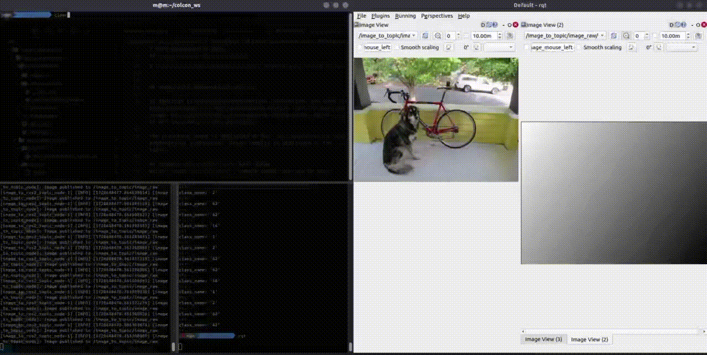

# YOLO Segmentation Node

The `yolo_segmentation` package is a ROS 2 node that leverages YOLO for real-time image segmentation. This node subscribes to an image topic, performs segmentation on the images using the YOLO model, and publishes both the segmentation results and the processed image with visual overlays. It supports both CPU and GPU inference, and the behavior can be configured through ROS parameters.

## Key Features

- **YOLO Segmentation**: Utilizes the YOLO model for image segmentation, offering high accuracy and performance in real-time.
- **GPU Support**: The node supports GPU inference if available, ensuring faster segmentation processing.
- **Configurable Parameters**: The node allows easy configuration of image topics, model paths, class labels, and more through ROS parameters.
- **Segmentation Publishing**: Segmented objects are published with their class labels on a dedicated ROS topic.
- **Image Output with Segmentation**: The node publishes the processed image with the segmentation results visually overlaid on the original image.
- **Color-coded Segmentation**: Each object class is assigned a random color for easy visual differentiation in the segmentation output.

## Prerequisites

Before using this package, ensure the following dependencies are installed:

1. ROS 2 Foxy or later
2. [cv_bridge](https://github.com/ros-perception/vision_opencv)
3. [ultralytics](https://pypi.org/project/ultralytics/) (for YOLO model)
4. [PyTorch](https://pytorch.org/) (with CUDA support if using GPU)
5. `image_recognition_msgs` package (for segmentation message types)

### Installing PyTorch and YOLO

To install the required libraries, run the following commands:

```bash
$ pip install torch torchvision torchaudio --index-url https://download.pytorch.org/whl/cu118  # For GPU support
$ pip install ultralytics
```

## Installation

1. Clone the repository into your ROS 2 workspace:
   ```bash
   $ cd ~/colcon_ws/src
   $ git clone https://github.com/mjlee111/yolo_segmentation.git
   ```

2. Build the workspace:
   ```bash
   $ cd ~/colcon_ws
   $ colcon build
   ```

3. Source the workspace:
   ```bash
   $ source ~/colcon_ws/install/setup.bash
   ```

## Launching the Node

To launch the `yolo_segmentation_node`, use the provided launch file. You can configure parameters through a YAML file or pass them directly as launch arguments.

Example launch command:
```bash
$ ros2 launch yolo_segmentation yolo_segmentation_launch.py
```

## Parameters

The following parameters can be configured when launching the node:

| Parameter Name      | Type    | Default Value          | Description                                                                |
|---------------------|---------|------------------------|----------------------------------------------------------------------------|
| `image_topic`        | `string`| `/camera/image_raw`     | The ROS topic to subscribe to for input images.                            |
| `use_gpu`            | `bool`  | `False`                | Whether to use GPU for YOLO inference.                                     |
| `model_path`         | `string`| `yolov11n.pt`          | Path to the YOLO model file (.pt).                                         |
| `class_path`         | `string`| `class.txt`            | Path to the file containing class names for detected objects.               |
| `image_encoding`     | `string`| `bgr8`                 | Image encoding for input images (e.g., `bgr8`, `rgb8`).                    |
| `yolo_version`       | `string`| `v11`                  | YOLO version to use (e.g., `v8`, `v11`).                                   |

## ROS Topics

| Topic Name                           | Message Type                                | Role                                                                |
|---------------------------------------|---------------------------------------------|---------------------------------------------------------------------|
| **/camera/image_raw/yolo_segmentation**| `image_recognition_msgs/msg/SegmentationMsgs`| Publishes segmentation information for detected objects.             |
| **/camera/image_raw/yolo_segmentation_image**| `sensor_msgs/msg/Image`                   | Publishes the segmented image with color overlays for detected objects. |

## Using GPU for YOLO Inference

To enable GPU inference, set the `use_gpu` parameter to `True` and ensure you have a CUDA-compatible device with PyTorch installed for GPU support.

Example command:
```bash
$ ros2 launch yolo_segmentation yolo_segmentation_launch.py use_gpu:=True
```

## Image with Segmentation Overlays

In addition to publishing segmentation information, the node also publishes the processed image with the segmentation results visually overlaid on the original image. Each object class is assigned a random color, which is consistently applied to all instances of the same class.

The processed image is published on the `yolo_segmentation_image` topic, while the segmentation information (class labels) is published on the `yolo_segmentation` topic.

## Example with classic yolo test image
Using `image_to_ros2_topic`, sample image test can be done.


